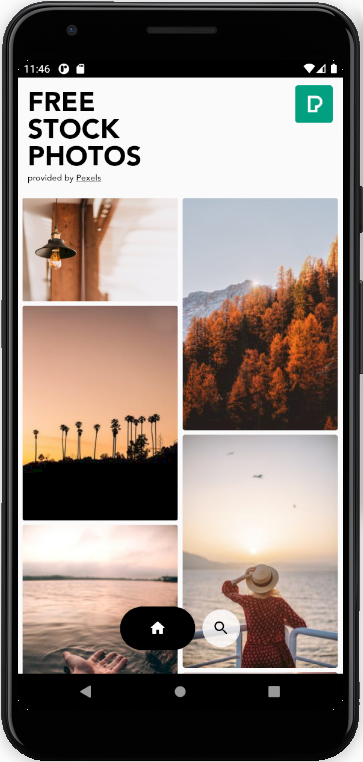
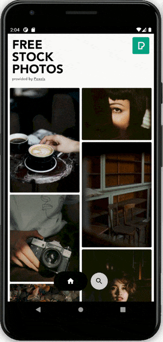

# Stock Photo App 
An Android application to browse and download stunning photos.:earth_asia:  
Data used are retrieved from [Pexels](https://www.pexels.com/api/)' free stock photos.  
This project is a training in Android programming.  

## Overview
 

  
  

 

The main screen of the application shows a selection of curated photos.  
A second screen allows to search for photos using keywords.:mag_right:  
Touching a photo displays it in full screen in a zoomable view.  
Photos can be saved in user's device's gallery in one click.  

## Run the app
### Using APK
[Latest release](https://github.com/vaflag/stock-photo/releases/tag/v1.0) provides a signed APK that can be installed on an Android device.  
Just install and run the app on a device.

### Using code
The code can be cloned then launched using [Android Studio](https://developer.android.com/studio).  
An ***API key*** must be retrieved from [Pexels' website](https://www.pexels.com/api/?locale=en-US) and added to the code in order to run the app this way.  
Just create an account to get one instantly. This step is necessary to allow the application to access the photo database.:key:  
The key has to be copied into the file `api-key.gradle` at the root of the project, just like this :  
`ext.api_key = "your_key_in_quotes"`
